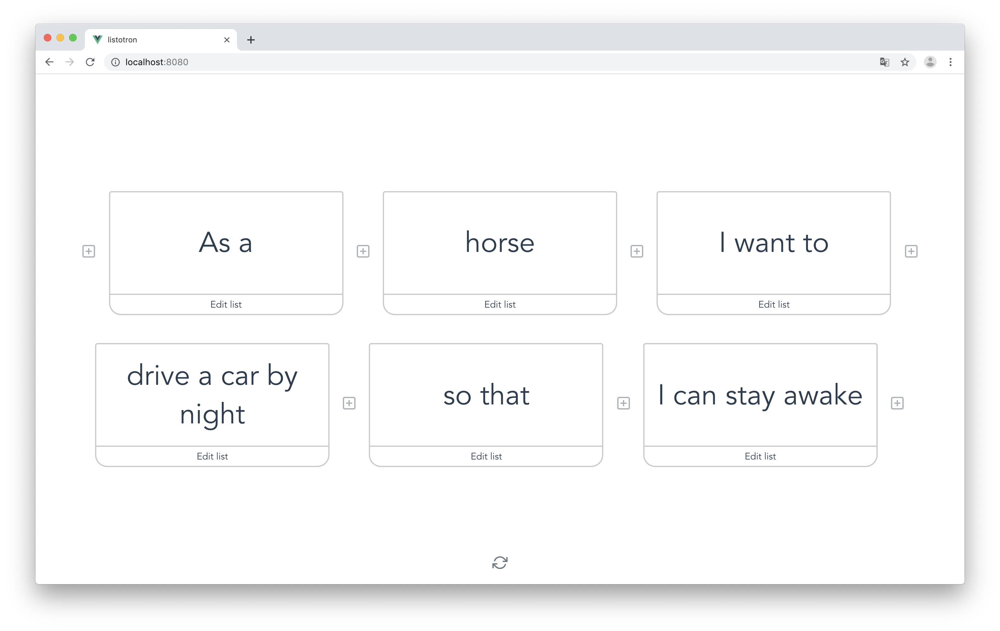

# listotron

> A very simple text generator based on lists

▶️ Try it here: <http://listotron.lipsumar.io>



## Dev notes

This is a proof-of-concept with a very crude implementation. It should be refactored with a vuex store before making any other change.


## Project setup
```
npm install
```

### Compiles and hot-reloads for development
```
npm run serve
```

### Compiles and minifies for production
```
npm run build
```

### Run your tests
```
npm run test
```

### Lints and fixes files
```
npm run lint
```

### Customize configuration
See [Configuration Reference](https://cli.vuejs.org/config/).
